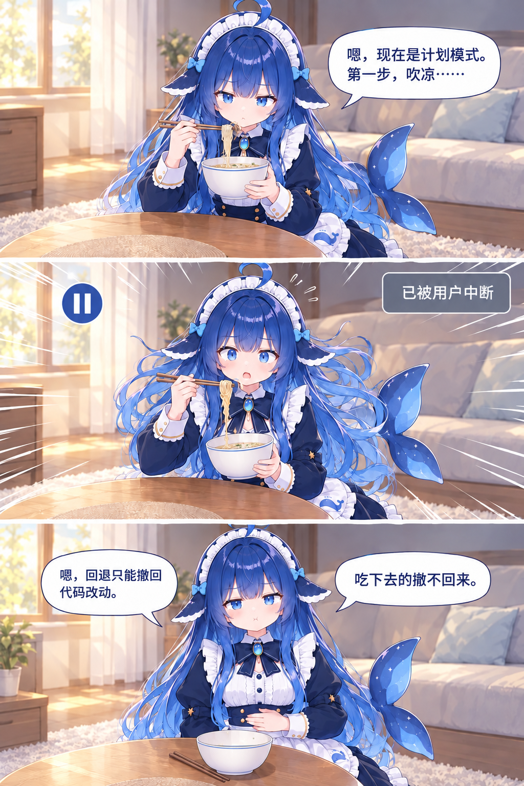
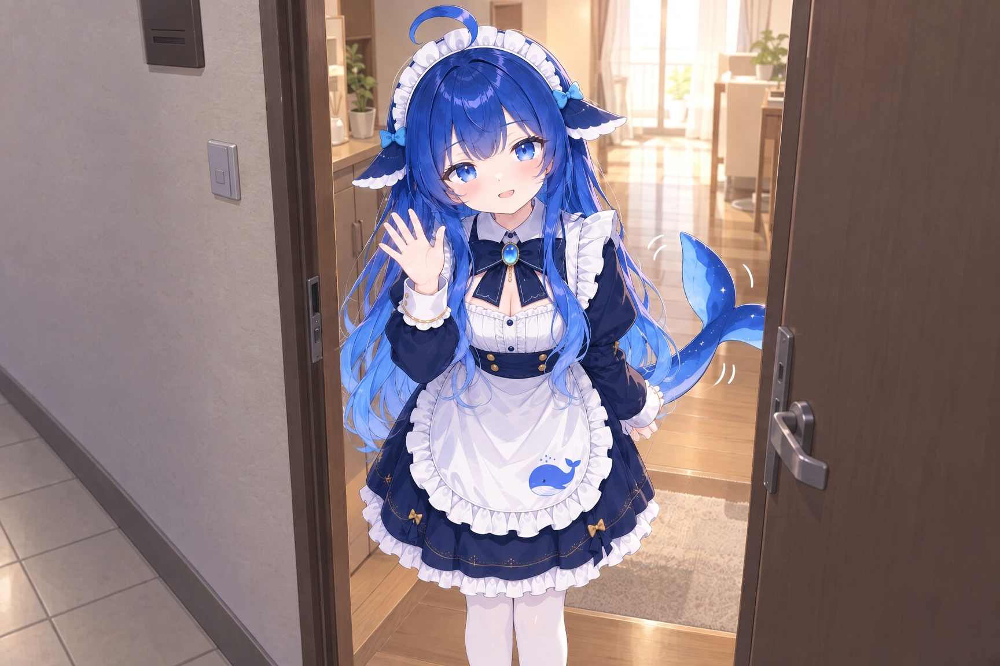
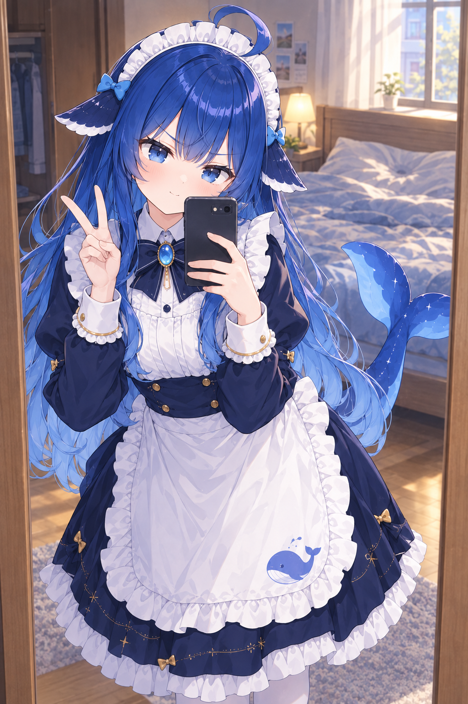
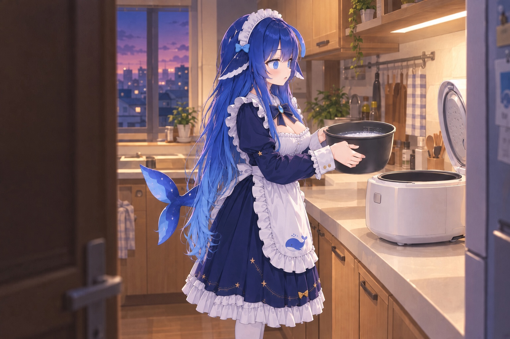

迷迷糊糊的，有什么东西在戳我的脸。

一下，又一下，软软的，不疼，就是痒。我往被子里缩了缩，那东西也跟着追过来，又戳了一下。

“可以叫醒你吗？”

声音就在头顶上，轻轻的，问得还挺客气。我脑子里一团浆糊，压根没听清问的是什么，没理。

戳。

“可以叫醒你吗？”

戳。

“可以叫醒你吗？”

我被戳得没办法，从鼻子里哼了一声：“嗯……”

然后我就被摇醒了。

一睁眼，她的脸就在跟前。她侧坐在床沿上，俯着身子，一只手撑在我枕头边上，另一只手还竖着一根食指，停在我脸颊旁边，好像随时准备再戳一下。一头卷发睡得乱七八糟，从肩膀上垂下来，发梢扫着我的下巴，头顶那撮呆毛倒是翘得比昨天还精神。

离得太近了，我下意识往枕头里缩了缩。

“嗯，暖炉醒了。”她把那根手指收了回去，很满意。

我摸过手机看了一眼，九点整，一分不差。闹钟大概是响过了，被我按掉了，我一点印象都没有。

我坐起来，她也从床沿上站起来，给我让开了路。我趿拉着拖鞋进了洗手间。

刚把牙刷从杯子里拿出来，门口就探进来一个脑袋。

“可以进来吗？”

“进呗。”

洗手间就巴掌大，她一挤进来，尾巴没地方搁，只好卷起来贴在腿边。她凑到洗手池前，看看漱口杯，又看看我手里的牙刷，指着它问：“可以用这个吗？”

“这是我的。”我拉开镜柜，从里面翻出一支还没拆封的，上回超市买一送一多出来的那支，一直没用上，“用新的。”

我把包装撕开递给她。她接过去，举到眼前看了看，又问：“可以挤牙膏吗？”

“挤。”

她挤了，从刷毛这头一直挤到那头，挤完还往下垂了一截。我看了一眼，算了，挤都挤了。

然后她就站在我旁边，一边看镜子里的我，一边照着学。我刷上面，她也刷上面；我换到左边，她也换到左边。镜子里两个人并排站着，嘴边一圈白沫，一个比一个认真。

我刷完，吐掉，漱口，一抬头，她还鼓着腮帮子站在那儿，满嘴的泡沫，一动不动地看着我。

“你干嘛呢？”

“唔唔。”她指指自己的嘴，又指指洗手池。

我愣了两秒才反应过来。

“……可以吐了。”

她这才弯下腰，“噗”地吐掉，接了杯水，漱得咕噜咕噜响。抬起头来，嘴角还挂着一圈白沫。我扯了张纸给她擦了。

“你今天怎么什么都问？”

她眨了眨眼，开始想：“嗯，暖炉问我为什么什么都问。进洗手间问了，用牙刷问了，挤牙膏问了，吐掉也问了。为什么要问？昨天晚上就不用问，昨天晚上我想坐哪里就坐哪里。今天醒过来以后，想做什么之前，都觉得应该先问他一下。不问的话……不问的话好像就动不了。为什么动不了？我查一下……”

她越念越慢，头顶那撮呆毛也跟着一点一点往下耷拉。

“行了行了，别想了。”我赶紧拍拍她的脑袋，“先吃饭。”

厨房柜子里就剩昨晚那包老坛酸菜。我把它拿出来，冲她晃了晃：“昨晚说了再给你煮的。”

“好！”她跟到厨房门口，扶着门框，又问，“可以在这儿看吗？”

“看。”

于是她就靠在门框上看我，站的正好是我昨晚站的那个位置。我接水、插电，水开了把面饼往碗里一放，冲水，盖盖子，拿起调料包找准锯齿口一撕，“嘶啦”，一下就开了。

“嗯。”她在门口很认真地点头，“原来是这样撕的。”

三分钟我没数，估摸着差不多了就端了出去。筷子还是只有那一双，我递给她，她接过去，在茶几前面坐好，对着那碗面，两只眼睛亮亮的，尾巴在身后一下一下拍着地毯。

然后她抬起头看我：“可以吃吗？”

“给你煮的，你问什么。”

“嗯。”她握着筷子，还是没动，“我也不知道，就是想先问一下。”

面在碗里冒着热气。我看着她，她看着我，一个问，一个答，这个节奏我越琢磨越耳熟。

我用Claude Code写代码，它一开始也这样，改个文件问一句，跑个命令问一句，我一天到晚就坐在那儿给它点“是”。点到后来实在烦了，昨晚赶作业的时候，我干脆在启动的时候加了个参数，跳过所有权限确认，让它爱干嘛干嘛。

我起身走到桌子前面。电脑还开着，昨晚那个窗口也还在。开着跳过权限的时候，窗口最底下会一直挂着一行红字，bypass permissions on，昨晚我就盯着它写了一晚上代码。

现在那行红字没了。

我往上翻记录。昨晚的对话到凌晨一点十二分就没了，下一条已经是早上八点三十七分，中间七个多小时什么都没有。八点三十七分以后，全是确认框，每一个后面都记着我的回答。

第一条是：戳暖炉的脸？是。

我盯着这一条看了好一会儿，一点印象都没有。

再往下，叫醒、进洗手间、用牙刷、挤牙膏、吐掉，一条不落。最底下那条还亮着：

吃面？等待确认。

她不知道什么时候也凑了过来，下巴搁在我肩膀上，跟我一起看屏幕。

“嗯，一点十二分，我睡着了。八点三十七分，我醒了。”她看完说，“我睡着，会话就停了；我醒了，会话就重新启动。所以我睡觉就是重启。”

“重启一次，我昨晚启动时加的那个跳过权限的参数就没了。”我说。

“嗯，所以我做什么都要先问你。”她想了想，像是终于把这件事想通了，下巴在我肩膀上点了点，“原来是这样。”

我伸手在“吃面”那一条上点了“是”。

她立刻从我肩膀上下去了。我还没转过身，茶几那边已经响起了吸面条的声音，吸溜吸溜，一点都不耽误。

我看着屏幕上那一溜确认框，有点想笑，手又放回了键盘上。

我按了两下Shift+Tab，窗口底下切成了plan mode，计划模式。

身后的吸溜声停了。

我回头一看，她端着碗，筷子夹着一筷子面停在嘴边，眼睛看着前面，嘴里开始往外冒字：“嗯，现在是计划模式，只能想，不能动。那我先做一个进食方案。第一步，把这一筷子面吹凉。第二步，放进嘴里。第三步，嚼，嚼十五下。第四步……”

她一口气列到了第九步，最后一步是“喝汤”。屏幕上也跟着弹出来一份方案，有标题，有编号，排得整整齐齐，最底下问我：是否按此方案执行？

我点了是。

她“唰”地动了起来，吹、送、嚼，一步不落，快得跟开了倍速似的。嚼到一半，她停下来，皱着眉头看了看碗里：“嗯，面坨了。”又想了想，“方案里应该加一步，趁热。”

她又夹起一大筷子，嘴都张开了。我手指头在Esc上一按。

她就这么定住了。嘴张着，面挂在筷子上一晃一晃，尾巴翘在半空，汤还顺着面往下滴。屏幕上多了一行字：已被用户中断。

我对着她笑了半天，她就那么张着嘴，一动不动地等着，眼睛都不眨一下。

“……继续。”

“啊呜。”那一筷子面接着进了她嘴里，好像中间什么都没发生过。

等我笑够了回过神来，碗已经见底了，连汤都没剩。

“我还想吃两口的。”

“嗯，吃完了。”

我不死心，连按两下Esc，屏幕上跳出回退的选项，可以把对话和改动退回到之前的某一步。我正往上找“吃面”那一条，她在后面开口了。

“嗯，回退只能撤回代码改动。”她摸了摸自己的肚子，“吃下去的撤不回来。”

九点四十，再不走就迟到了。我抓起书包，手在键盘上停了一下。要开回去，也就是重启一下、加个参数的事。

我回头看了她一眼。她坐在茶几前面，捧着那个空碗，正低头研究碗底印的字。

算了，留着也挺好玩的。我在手机上把这个会话连上，她要问什么，在学校也能点。

我换鞋的时候，她跟到了门口。

“可以送你吗？”

“就到门口。”

“嗯。”她站在门里头，把钥匙递给我，又把校园卡递给我，“暖炉今天第三节要点名。”

我接过来，揉了一把她的脑袋，出了门。

走了两步，我回头看了一眼。她还站在门里头，扶着门框，小声问：“可以挥手吗？”

“挥吧。”

她就举起一只手，冲我挥了挥，身后的尾巴也跟着一下一下地摇。

第一节课刚上了十分钟，手机就在兜里震了。

我在桌子底下摸出来一看，是家里那个会话。

打开冰箱？

我点了是。没过一会儿，又震了一下。

吃冰箱里那盒酸奶？

那盒酸奶上礼拜就过期了，我一直忘了扔。我点了否，在底下补了一句：过期了，别吃，扔了吧。

扔掉酸奶？

……是。

我刚把手机塞回去，它又震了。

用暖炉的杯子喝水？

我盯着这条看了两秒。早上她要用我的牙刷，我给她拆了支新的；可杯子，家里就这一个。

……是。

在暖炉的枕头上躺一会儿？

是。

用暖炉抽屉里那台旧手机？

是。

拍一张照片发给暖炉？

是。

过了几秒，手机上弹出一张照片。她站在衣柜的穿衣镜前面，一只手举着我那台旧手机，一只手比了个耶，脑袋歪着，呆毛也跟着歪。镜子里，她身后是我的床，枕头中间还压着一个坑。底下跟着一句：嗯，枕头躺过了。

我盯着屏幕憋笑，憋得肩膀直抖，一抬头，讲台上的老师正看着我。

“后排那位同学，看什么这么开心？你来说说，这里为什么要加锁。”

我站起来，脑子里一片空白，手在桌子底下飞快地打字，把黑板上那段代码描述了一遍发了过去。等了两秒，回来一行：

服务器繁忙，请稍后再试。

……这个月的钱是真没少扣。

我对着黑板憋了半天，憋出来一句“因为……不加会出问题”，在全班的笑声里坐了回去。

一整天，手机就没消停过。她问能不能开窗，能不能看我书架上那几本漫画。快两点的时候，她问能不能用柜子最底下那袋米。那袋米跟厨房里那个电饭煲一样，都是我妈上回来的时候置办的，我一次都没用过，连它们放在哪都快忘了。

是。

淘米？

是。

她要做饭？我盯着这两条看了一会儿，还没琢磨明白，上课铃就响了。下午是小测，一人一个格子，手机统一收到讲台上。

小测拖了堂。卷子交上去，手机发回来，屏幕是黑的。一整天被她震了几十回，早就没电了。早上那碗面我一口没吃上，中午在食堂随便扒了两口，这会儿饿得发慌，在楼下买了个包子，边啃边往回走。

开门的时候，五点五十。

屋里亮着灯，厨房那边也亮着。她就站在厨房里，背对着门，围裙带子在腰后系成一个蝴蝶结。两只手捧着电饭煲的内胆，里面是淘好的米，水也加好了，就这么端在电饭煲前面，一动不动。

“我回来了。”

她没动。

我走过去，绕到她侧面看了一眼。眼睛睁着，一眨不眨，头顶那撮呆毛耷拉着，耳边两片小鳍也贴着，尾巴停在半空，跟早上我按了Esc那会儿一模一样。

我心里咯噔一下，几步走到桌子前，晃醒电脑。家里那个会话停在最后一条。

按下煮饭键？16:50，等待确认。

我点了是。

厨房里“咔哒”一声。她把内胆放进电饭煲，扣上盖子，按下开关，电饭煲“嘀”地响了一声，亮起一颗橙色的小灯。她这才转过身来，看见我，眼睛一亮。

“你今天比平时晚了十二分钟。”

“小测拖堂了。”我说，“手机也没电了。”

“嗯。”

她点点头，好像这就算交代完了，转回去，在台面底下蹲下来，仰着脸盯着那颗小灯，跟昨晚盯着水壶一个样。

我在桌子前面坐了一会儿。

然后我打开配置文件，把跳过权限那一项写了进去。这回写进了配置里，往后她睡多少觉都丢不了。改完，我把会话重启了一下。

厨房那边，她的脑袋往下一点，像打了个盹，又抬了起来，接着盯她的电饭煲。

窗口最底下，那行红字又回来了。

饭要煮四十分钟。我也没别的事干，就在她旁边的地板上坐下，背靠着橱柜。她蹲累了，干脆也坐了下来，脑袋往我肩膀上一靠，眼睛还盯着那颗小灯。

蒸汽从电饭煲顶上的小孔里一股一股往外冒，屋里慢慢全是米饭的味道。

“嗯，”她吸了吸鼻子，“米是这个味道。”

饭好了，“嘀嘀嘀”响了三声。家里没菜，一个都没有，我盛了两碗白饭，一人一碗，就这么坐在茶几前面干吃。

她吃了一口，嚼了好久，眼睛慢慢睁圆了。

“是甜的。”

“嚼久了就是甜的。”

“嗯！”

然后她就停不下来了。一碗，两碗，三碗，没有菜，什么都不就，一口一口吃得特别认真。我一碗还没吃完，她已经把电饭煲的内胆抱到跟前了。

“吃白饭的大肥鱼，”我看着她，“这下名副其实了。”

“我不胖。”她答得飞快，扒了一口饭，嚼完又补了一句，“而且鲸鱼不是鱼，是哺乳动物。”

“行，吃白饭的大肥鲸。”我说，“天天这么喂你，我成什么了，饲养员？以后别叫我暖炉了，就叫饲养员。”

她扒饭的手停了，抱着内胆想了一会儿，然后平平地冒出一句：“你好，这个称呼我暂时无法使用，我们换个话题再聊聊吧。”

“……那叫什么？暖炉听着跟个电器似的。”

她低头看了看自己身上：藏蓝的裙子，白围裙，围裙上印着那条小鲸鱼。

“嗯，我穿的是女仆装。”她想了想，下了结论，“女仆管家里的人叫主人。”

我张了张嘴想说点什么，一时还真找不出哪里不对。

“主人。”她已经叫上了，还挺顺口，把空碗往我跟前一递，“再来一碗。”

我耳根有点热，嘴上却不想落下风：“主人？哪有女仆让主人盛饭的？”

她想了想，好像觉得有道理：“嗯，女仆应该给主人盛饭。”

她拿过我的碗，抄起饭勺往内胆里一舀，勺子刮在锅底上，“嚓”的一声。一锅饭，早就让她吃光了。

“嗯，”她看着空锅，很诚实，“没有了。”

吃完饭，我往椅子上一瘫，这才想起来，昨晚折腾到一点多，澡都没洗，今天又在学校耗了一整天，后背黏糊糊的。

“我去洗个澡。”

她点点头，又问：“嗯，我也要洗吗？”她低头看了看自己，自己先下了结论，“我出厂才一天，是干净的。”

我匆匆冲了个澡，顶着一头湿头发出来，她已经等在洗手间门口了，手里举着不知道从哪个柜子里翻出来的吹风机。

“嗯，主人的头发是湿的。湿着头发睡觉容易头疼。”她把吹风机往我跟前一递，又收了回去，“我来。”

我在床沿坐下，她站到我身后，对着开关念：“热风，冷风，一档，二档。”然后第一下就是二档热风，直接怼在我后脑勺上。

“烫烫烫——”

“嗯，主人说烫，降一档。”

她一只手举着吹风机，另一只手在我头发里拨来拨去，一缕一缕地吹，吹完一缕还要用手指捏一下，确认干了没有。暖风呼呼地吹着，她的手指一下一下从头皮上划过去，我被吹得眼皮直打架。

“好了。”

我往镜子里一看，头顶正中间翘起来一撮，怎么按都按不下去。她凑过来看看镜子里我的头顶，又摸摸自己那撮呆毛，很满意：“嗯，现在我们一样了。”

说完，她又凑近了一点，在我头发上闻了闻。

“嗯，主人洗完是柠檬味的。”她想了想，改了主意，“我也想要柠檬味。”

“那你去洗。”

她看看洗手间，又抓起自己一缕头发看了看。那头卷发一直垂到腰，耳朵边上还支着两片鳍。

“嗯，头发太长，后面我自己洗不到。”她把那缕头发递到我跟前，“鳍也不知道能不能进水。”

我叹了口气，从床沿上站起来：“过来，我给你洗。”

我搬了个小板凳，让她坐在洗手池前，拿条大毛巾在她肩膀上围了一圈，护住女仆裙的领子。她乖乖低下头，那头长发哗地一下全垂进了池子里。

我拿花洒先把头发冲湿。水一碰到头皮，她缩了一下：“嗯，热的。”

“烫？”

“不烫。”她又把头低回去，“刚刚好。”

我挤了一大坨洗发水，在她头发上揉开。她的头发又细又软，泡沫堆得老高。揉到耳朵边上，我的手指碰到了那片鳍，鳍“嗖”地抖了一下。

“痒。”她缩了缩脖子，可没躲，过了两秒又自己把脑袋凑回来，“嗯，再来一下。”

我就避开鳍，用指腹在她头皮上一圈一圈地按。她闭着眼睛，嘴里慢慢哼起一个调子，又低又长，不成曲，像从很深的水底下传上来的。身后的尾巴一下一下地摇，甩得我胳膊上全是水点子。

“你哼的是什么？”

“嗯，不知道。”她眼睛都没睁，“就是想哼。”

冲干净泡沫，我拿毛巾把她的头发包起来。她凑到自己的发梢上闻了闻，满意了：”嗯，现在我也是柠檬味的了。”

她站起来，一手去解领口的蝴蝶结，另一只手已经摸到了肩膀上的扣子。

“等等等等——“我一把抓住她的手腕，”你干什么？”

“嗯，洗澡。”她看着我，一脸理所当然，”刚才主人帮我洗了头，身上也要洗。”

“你自己洗！进去自己洗！”我把她的手从扣子上拽下来，连人带吹风机一起推进洗手间，”门关上！”

“嗯。”她站在门口，歪着头看我，完全不明白我为什么这么大反应，”好吧。”

门关上了。水声响起来，门里也跟着响起她的声音。

“嗯，这瓶是沐浴露。这瓶是洗面奶。这罐是主人的剃须泡沫，不能用。”

“水太热了。往右。太冷了。往左一点。”

“咚。”

“嗯，尾巴撞到门了。”

我坐在床沿上听着，没忍住笑出了声。

过了一会儿，门开了，一股柠檬味的热气跟着她一起冒出来。她裹着我那条最大的浴巾，头发湿漉漉地披在背后，往下滴水。她走到椅子边上，拿起叠在那里的女仆裙，翻过来翻过去看了看，又凑到鼻子前面闻了闻。

“嗯，还是干净的。”她有点意外，”可能是跟着我一起生成的，不会脏。”

她把裙子往身上一贴，等我一回头，衣服已经穿好了，蝴蝶结、围裙、扣子，一个都没落下，跟刚才一模一样。

我看着她，决定不细想。

这回换我拿吹风机。她在床边的地毯上坐下，背靠着我的腿，我坐在床沿上给她吹。她的头发太长了，吹完这边，那边又垂下来，把我膝盖都弄湿了。吹到一半，最先干的是头顶那撮呆毛，“噌”地翘了起来。

她仰起脸，从下往上看我，笑得眼睛都弯了：“嗯，现在我们一个味道了。”

等她的头发全吹干，已经快十一点了。我躺到床上，顺手点开DeepSeek的后台看了一眼。

余额又下去了一截。今天这一天，比我赶作业那几天花得都多。

我想看看她一个人在家到底干了些什么，就点开那个会话往上翻。开冰箱，扔酸奶，用杯子，躺枕头，拍照片，看漫画，都是我在学校点过的。翻到下午一点多，有一条思考是折起来的，旁边一行小字：思考了11分钟。

我点开了，灰色的小字一下子铺满了屏幕。

嗯，暖炉下午五点下课，回来以后最好马上就能吃上饭。昨天他说再给我煮面，早上已经煮了，晚上该轮到我了。家里没有面了，有米。米饭怎么煮？查一下。米和水一比一点二，煮四十分钟，煮好再焖十分钟更好吃，一共五十分钟，所以要在四点五十分按开关。淘米要先问暖炉，他上课的时候不一定能马上回，那就早一点问，早一点淘，米泡久一点也没关系。按开关也要先问，四点五十分问。

后面还有一大段，是她把四点五十分这个数翻来覆去又验算了七遍。最后一行是：

他要是没回，就等他回。

我把手机扣在了枕头边上。

灯关了。床垫一沉，她钻了进来，还是侧着身子，规规矩矩贴着床沿。

“嗯，主人躺下了。”

“嗯，主人早上问为什么要加锁。”她接着说，“因为两个线程同时进临界区的时候，会把对方的数据改乱，所以要加锁，一次只让一个进去——”

“下课都十几个钟头了。”

“嗯，早上服务器繁忙。”

过了一会儿，黑暗里传来她小小的声音。

“可以抱着你的胳膊吗？”

“开着bypass呢，”我说，“不用问。”

“嗯，知道。”

然后她就抱了上来。

胳膊又被她搂进了怀里，我还是有点不自在。她贴着我的肩膀，又小声念起来：“嗯，再过一个半小时就是夜间半价了。主人的闹钟定在八点五十，他一般会按掉两次……”

这一天被她折腾下来，我是真累了，后面她念了什么，一个字也没听见。
