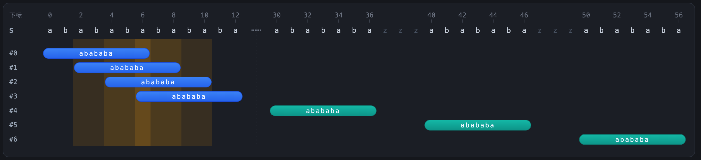
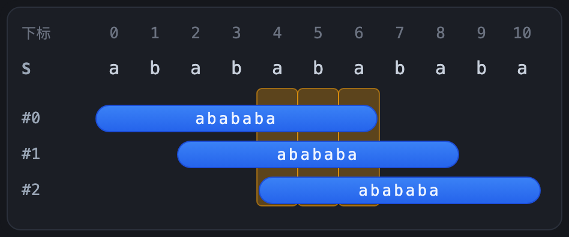
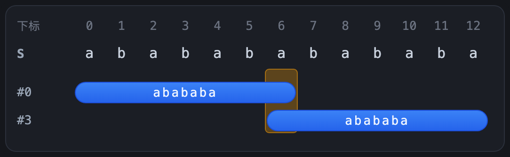
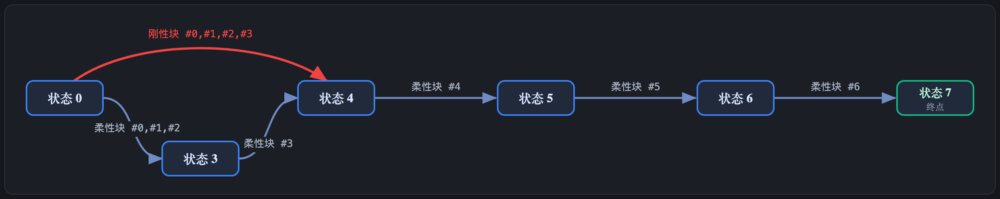
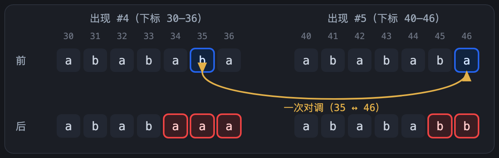
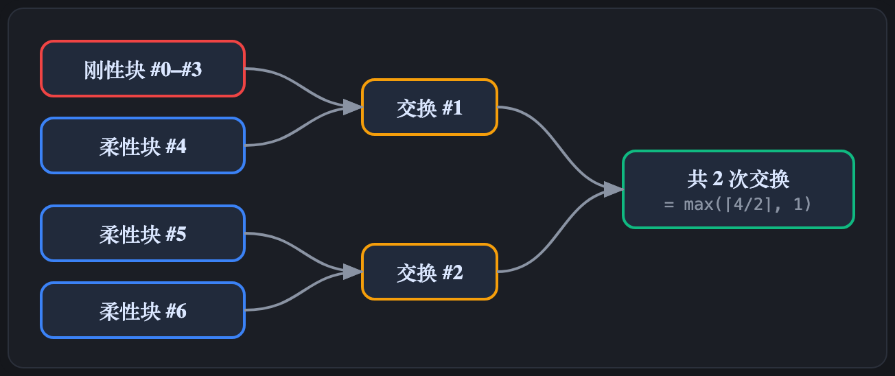
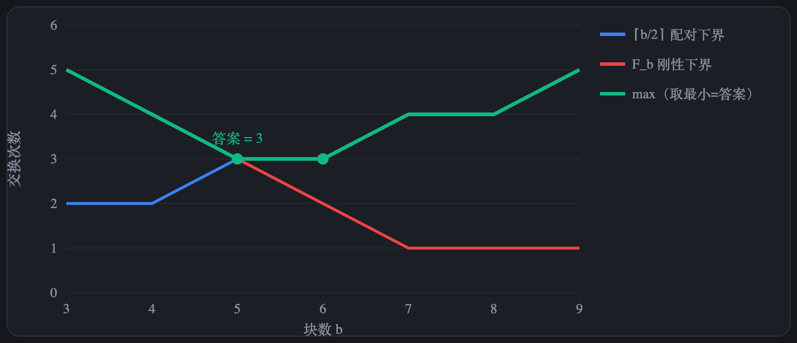
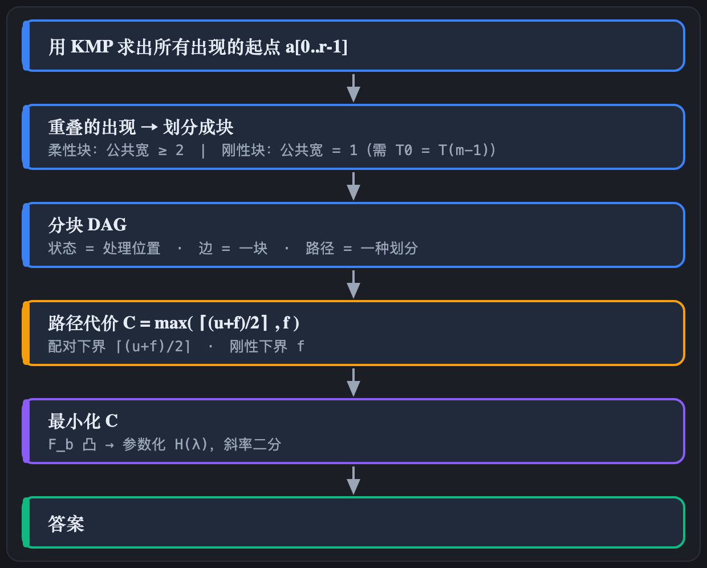

## 题目

给定字符串 $S$ 和模式串 $T$（记 $m=|T|$）。一次操作 = 在 $S$ 里任选两个位置，把它们的字符**对调**。求**最少操作次数**，使 $S$ 不再含有子串 $T$。

限制：$|T|\ge 3$，$T$ 相邻字符两两不同（$T_i\ne T_{i+1}$）；$S$ 可含任意额外字符。

换句话说，操作不改变字符的多重集，所以本题等价于：在 $S$ 的所有重排里，找一个不含 $T$ 的，使它到 $S$ 的**对调距离最小**（排列情形即 Cayley 距离）。

---

## 两个性质

整套解法反复用到两条性质，都由题目直接推出：

1. **一次交换最多改变 2 个位置的字符。** 后面所有"下界"都源于此。
2. **$T$ 相邻字符互不相同 ⟹ 哪里出现两个相邻相同字符，那一段就绝不可能是 $T$。** 后面"放心破坏目标、不产生新的 $T$"全靠它。

---

## 1. 例子

$$T=\texttt{abababa}\qquad(m=7)$$

它满足要求：相邻字符 `a,b,a,b,a,b,a` 两两不同；而且首尾相同 $T_0=T_6=\texttt a$（这一点后面会很关键）。

$$S=\texttt{ababababababazzzzzzzzzzzzzzzzzabababazzzabababazzzabababazzz}$$

其中 `z` 不在 $T$ 中，只用来把几段出现隔开。

**用 KMP 求出 $T$ 在 $S$ 里所有出现的起始下标**，共 7 个：

$$a=[\,\underbrace{0,\,2,\,4,\,6}_{\text{开头重叠的那段}},\ \ \underbrace{30,\,40,\,50}_{\text{三个孤立的 abababa}}\,]$$

把它们画在 $S$ 上：



**约定**：把这 7 个出现从左到右编号 `#0, #1, …, #6`。第 $i$ 个出现的起始下标记作 $a_i$，它占据下标区间 $[\,a_i,\ a_i+m-1\,]$（长度都是 $m=7$）。

> 顺带一个事实：因为 $T$ 相邻字符不同，**任意两个出现的起点至少相差 2**（不可能只差 1）。看开头那段，出现起点是 $0,2,4,6$，确实步长是 2。

---

## 2. 公共下标与分块

要消灭一个出现，**至少得改掉它内部的某一个字符**。

但请看开头那 4 个出现 `#0~#3`，它们**层层叠叠**。问一句：有没有哪个下标，被好几个出现同时盖住？如果有，那**只改这一个下标的字符，就能把盖住它的所有出现一起摧毁**。

于是整个问题变成一件事：

> **把 7 个出现从左到右划分成若干"块"，每一块内部的出现都共享某个公共下标。**
> 每一块只要在那个公共下标上动一下，整块就被破坏。

怎么判断"出现 #i 到 #j 这一段有没有公共下标"？因为区间等长，公共部分就是 $[\,a_j,\ a_i+m-1\,]$，它非空当且仅当

$$a_j-a_i\le m-1.$$

公共部分有多宽？正好是 $m-(a_j-a_i)$ 个下标。这个"宽度"决定了块的两种类型，下一节讲。

---

## 3. 两种块：柔性与刚性

### 柔性块：公共宽度 ≥ 2

条件 $a_j-a_i\le m-2$。

看 `#0,#1,#2`（起点 $0,2,4$，$m=7$）：



公共部分有 **3 个下标**（取所有出现里"最靠右的起点 4"到"最靠左的终点 6"）。注意：这是**三个出现一起**的公共部分，别和"只看前两个 #0∩#1 = 下标 2..6 = 5 个"搞混。用公式秒算：$m-(a_{\text{末}}-a_{\text{首}})=7-(4-0)=3$。

公共宽度 ≥ 2，**要破坏它，这 3 个下标里随便挑一个改都行**，余地大，所以叫"柔性"。

### 刚性块：公共宽度 = 1

条件 $a_j-a_i = m-1$。

看 `#0` 和 `#3`（起点 $0$ 和 $6$，差 $6=m-1$）：



公共部分**只剩 1 个下标** $p=6$，只能改它、别无选择，所以叫"刚性"。

而这唯一的公共下标 $p=a_i+m-1$ 有个隐含的前提。它同时是：

- `#0` 的**最后一格** → 字符是 $T_{m-1}$（这里 $=\texttt a$）；
- `#3` 的**第一格** → 字符是 $T_0$（这里 $=\texttt a$）。

同一个字符 $S_p$ 必须同时等于 $T_{m-1}$ 和 $T_0$，所以**刚性块能存在的前提是 $T_0=T_{m-1}$**，且这个公共下标上的原字符固定是

$$c=T_0=T_{m-1}.$$

（$T=\texttt{abababa}$ 正好 $T_0=T_6=\texttt a$，所以例子里会出现刚性块。如果 $T$ 首尾不同，刚性块根本不可能存在——这会让算法直接走简单分支。）

> 两种块的区别：柔性块有多个可改的公共下标，刚性块只有一个、且其原字符必为 $c$。后面所有的复杂度都来自这一区别。

---

## 4. 分块 DAG

把出现划分成块有多种方式；不同方式得到的柔性块、刚性块数量不同，所需交换次数也不同。我们要在所有划分方式中选最省的。下面把"所有划分方式"组织成一张有向无环图（DAG）。

### 4.1 处理顺序

从左到右处理。任一时刻只需记录一个量：**当前尚未被任何块覆盖、最靠左的出现的编号 $i$**，称为**状态 $i$**；下一块必须以 $\#i$ 为起点。

- 初始为状态 $0$（还没有出现被覆盖）。
- 每划出一块，状态前进到该块之外第一个未覆盖的出现。
- 7 个出现全部覆盖后到达状态 $7$（$=r$，终止状态）。

### 4.2 两种划分

在状态 $i$，必须以 $\#i$ 为起点划出一块。只需考虑两种**极大**划分：

**(A) 最大柔性块（总存在）。** 从 $\#i$ 起向右尽量多纳入出现，只要仍满足柔性条件"首尾起点之差 $\le m-2$"，直到无法再纳入。状态前进到该块之外第一个出现。

**(B) 刚性块（不一定存在）。** 若最大柔性块之外、紧邻的那个出现的起点恰为 $a_i+(m-1)$，可将它一并纳入，使公共宽度由 $\ge 2$ 收缩为 $1$，得到刚性块。状态再多前进一个出现。

每种划分对应 DAG 中的一条有向边。

### 4.3 在例子上枚举

阈值：$m=7$，柔性要求首尾差 $\le 5$、刚性要求差 $=6$；出现起点 $a=[0,2,4,6,30,40,50]$。逐个状态算出两种划分：

| 状态 $i$（起点 $a_i$） | 最大柔性块 | 柔性边终点 | 刚性边（当 $a_{g_i}=a_i+6$） |
|---|---|---|---|
| $0$（$0$） | $\{\#0,\#1,\#2\}$ | 状态 $3$ | 有：$\{\#0,\#1,\#2,\#3\}\to$ 状态 $4$ |
| $3$（$6$） | $\{\#3\}$ | 状态 $4$ | 无（$a_4=30\ne 12$） |
| $4$（$30$） | $\{\#4\}$ | 状态 $5$ | 无 |
| $5$（$40$） | $\{\#5\}$ | 状态 $6$ | 无 |
| $6$（$50$） | $\{\#6\}$ | 状态 $7$ | 无 |

状态 $1,2$ 不会作为起点出现——它们已被状态 $0$ 的柔性块覆盖。

### 4.4 DAG 与路径

把每个状态画成节点、每种划分画成一条有向边（红色为刚性边），即得下面的 DAG。终止状态编号 $7$（$=r$）。编号不连续是正常的：状态 $0$ 一步覆盖 $\{\#0,\#1,\#2\}$ 直接到达状态 $3$，故状态 $1,2$ 不出现在图中。



从状态 $0$ 到状态 $7$ 的每条路径对应一种完整划分。本例只有两条：

- **路径①（全柔性）**：$0\to3\to4\to5\to6\to7$，共 5 块、全为柔性、0 刚性。
- **路径②（含刚性边）**：$0\to4\to5\to6\to7$，共 4 块、其中 1 刚性。

记 $g_i=\min\{\,j\mid a_j>a_i+m-2\,\}$，即状态 $i$ 划出最大柔性块后到达的状态（例如 $g_0=3,\ g_3=4$）。于是有**柔性边** $i\to g_i$；当 $a_{g_i}=a_i+(m-1)$ 时，另有**刚性边** $i\to g_i+1$。

下一步：求每条路径所需的交换次数，并取最小。

---

## 5. 一条路径的代价 $C(u,f)$

设这条路径划分出 $u$ 个柔性块、$f$ 个刚性块。它需要的最少交换次数是

$$C(u,f)=\max\!\Big(\Big\lceil\tfrac{u+f}{2}\Big\rceil,\ f\Big).$$

这个 $\max$ 里两项各自是一条**下界**（至少要这么多），而且能同时达到（**上界**）。

### 5.1 配对下界 $\lceil\frac{u+f}{2}\rceil$

一次交换最多改 2 个下标 ⟹ $k$ 次交换最多改 $2k$ 个下标。每个块都得至少被改一个下标才能摧毁，且不同块各用各的下标。所以

$$\text{块数 }(u+f)\le 2k\ \Longrightarrow\ k\ge\Big\lceil\tfrac{u+f}{2}\Big\rceil.$$

直觉：**一次交换最多消除两块**，块数除以二向上取整是底线。

### 5.2 刚性下界 $f$

刚性块的唯一公共下标，原字符固定是 $c=T_0=T_{m-1}$，而摧毁它就必须把那一格的 $c$ 改成别的字符。

设 $A=\{$原字符为 $c$ 的下标$\}$，盯着"$A$ 里此刻装着非 $c$ 的下标个数"：开局是 0；一次交换最多让它 $+1$（只有当交换的某一端在 $A$ 里、且换进来一个非 $c$ 才增加）。所以 $k$ 次交换后，最多 $k$ 个原本是 $c$ 的格子变成非 $c$。$f$ 个刚性块各要一个这样的格子，于是 $f\le k$。

### 5.3 上界：配对与安全交换

要点是构造交换，**只破坏目标、不制造新的 $T$**——靠的就是性质 2："弄出相邻相同字符，那段就废了"。先讲直觉，再用一个具体例子看它怎么落地。

> **安全交换的直觉**：在柔性块的公共部分挑一格，把它改成"跟邻居相同"（比如把 $T_{m-2}$ 改成 $T_{m-1}$，弄出相邻的两个相同字符）。这样块里所有出现都被破坏，而任何新窗口要么撞上这对相同相邻字符（不可能是 $T$）、要么对不齐。把"这个块要改的格子"和"另一个块要改的格子"凑成**一次交换的两端**，就实现了一次交换消除两块。刚性块同理，只是只能动那唯一的 $c$ 格。

**先看一个具体例子**。拿例子里两个孤立的柔性块 `#4`（起点 30）和 `#5`（起点 40），都是 `abababa`。我们用**一次交换**同时消除它们。

挑两格：`#4` 的倒数第二格（下标 35，字符 `b`）和 `#5` 的最后一格（下标 46，字符 `a`）。**把这两格直接对调**：



一次交换，`#4`、`#5` **同时被破坏**，而且**没有产生新的** `abababa`（程序验证：出现列表从 `[0,2,4,6,30,40,50]` 变成 `[0,2,4,6,50]`，正好少了 30、40，没多任何东西）。

**为什么不冒新 T？** 关键是交换后在 34·35·36 弄出了 `aaa`、在 45·46 弄出了 `bb`。而 `abababa` 自己**从不含两个相邻相同字符**。任何想在这两处附近凑出 `T` 的新窗口，都会撞上 `aa` 或 `bb`，立即失效。`#4`、`#5` 自己也因为内部那一格被改而失配。**两块、一次交换、不产生新出现**——这就是上界能达到的原理。

**把这招拼起来**就得到总次数：尽量"刚性配柔性"，剩下的柔性两两配、刚性各自单干——恰好 $\max(\lceil\frac{u+f}{2}\rceil,f)$ 次。

> **要补的几个细节（选读）。**
>
> **① 安全格不止一个。** 上面是在"倒数第二格 `b→a`"和"最后一格 `a→b`"制造相同相邻字符。一个柔性块的两头附近一共有 **4 个**这样的安全候选格（记 $x=T_{m-2},y=T_{m-1},u=T_0,v=T_1$；在例子 `abababa` 里 $x=b,\,y=a,\,u=a,\,v=b$）：
>
> | 候选 | 在哪一格改 | 怎么改 | 例子里就是 |
> |---|---|---|---|
> | A | 块首出现的倒数第二格 | $x\to y$ | `b→a` |
> | B | 块首出现的最后一格 | $y\to x$ | `a→b` |
> | C | 块尾出现的第二格 | $v\to u$ | `b→a` |
> | D | 块尾出现的第一格 | $u\to v$ | `a→b` |
>
> 两块合用一次交换，就挑一对"改法正好互补"（一个 $x\to y$、另一个 $y\to x$，交换两端即可对调）的。刚才用的就是 A+B。
>
> **② 多次交换别互相干扰。** 若两次交换的安全格贴在一起，一处的改动可能毁掉另一处刚弄出的相同相邻字符。办法：把所有柔性块**按位置排序，左半统一用一种改法、右半统一用互补改法，再跨左右配对**——这样全串安全格的排布是"一种…一种…另一种…另一种"，不会在交界处冲突。
>
> **③ 刚性块更简单。** 刚性块只能动它那唯一的 $c$ 格，把 $c$ 改掉即可；它和一个柔性块也能凑成一次交换。单独一个刚性块、单独一个柔性块，也都各用一次交换就能解决。

下图是例子路径② $u=3,f=1$ 的配法（红=刚性，蓝=柔性，黄=一次交换）：



### 5.4 例子的两条路径

| 路径 | 划分出的块 | $u$ | $f$ | $C=\max(\lceil\frac{u+f}{2}\rceil,f)$ |
|---|---|---|---|---|
| ① 全柔性 | 柔`{#0,#1,#2}` 柔`{#3}` 柔`{#4}` 柔`{#5}` 柔`{#6}` | 5 | 0 | $\max(3,0)=3$ |
| ② 用刚性 | **刚**`{#0..#3}` 柔`{#4}` 柔`{#5}` 柔`{#6}` | 3 | 1 | $\max(2,1)=\mathbf2$ |

**最优 = 2 次交换**，走路径②。这就是为什么要引入刚性边：它把"柔性块`{#0,#1,#2}` + 孤立的`{#3}`"两块**合并成一块**，块数从 5 降到 4，把配对下界从 3 压到 2，代价只是多 1 个刚性块（而 $f=1$ 还没成为瓶颈）。

---

## 6. 最小化 $C(u,f)$

问题现在很干净：**在 DAG 的所有 $0\to r$ 路径里，最小化 $C(u,f)=\max(\lceil\frac{u+f}{2}\rceil,f)$。**

### 6.1 化简到 $F_b$

注意 $C$ 随 $f$ 增大而变糟。所以对每个可能的**总块数** $b=u+f$，我们只关心**能做到的最少刚性块数**，记作

$$F_b=\big(\text{恰好划分成 }b\text{ 块时，最少的刚性块数}\big).$$

那么

$$\boxed{\ \text{答案}=\min_{b}\ \max\!\Big(\Big\lceil\tfrac b2\Big\rceil,\ F_b\Big).\ }$$

### 6.2 $O(r^2)$ DP

在 DAG 上做 DP。注意：**每条边（无论柔性还是刚性）都恰好对应一块**；区别只在刚性边额外计 $+1$ 个刚性。所以沿一条路径，$b$ = 经过的边数，$f$ = 其中刚性边的条数。

定义 `dp[i]` = 一张表：「从状态 $i$ 到终止状态 $r$、划分成 $b$ 块时，最少能有几个刚性块」。

- 边界：`dp[r] = { 0块: 0个刚性 }`。
- 转移（状态 $i$ 看它的两条边）：
  - 柔性边到 $g_i$：把 `dp[g_i]` 每个 $(b,f)$ 变成 $(b+1,\,f)$；
  - 刚性边到 $g_i+1$（若存在）：把 `dp[g_i+1]` 每个 $(b,f)$ 变成 $(b+1,\,f+1)$；
  - 同一个 $b$ 取更小的 $f$。

最后读 `dp[0]` 这张表，套公式 $\min_b\max(\lceil b/2\rceil,F_b)$。状态 $O(r)$、每个表大小 $O(r)$，总 $O(r^2)$。

**在例子上跑一遍**：`dp[0]` 只有两项

$$F_4=1,\qquad F_5=0,$$

于是

$$\text{答案}=\min\big(\ \max(\lceil 4/2\rceil,1),\ \max(\lceil 5/2\rceil,0)\ \big)=\min(2,\,3)=\mathbf2,$$

跟前面手算一致。**数据规模不大时，到这里就够用了。** 下面 6.3、6.4 只是为了把 $r$ 大到 $2\times10^6$ 也跑过，属于进阶选读。

### 6.3 $F_b$ 的凸性

$F_b$ 有两个好性质：

- **递减**：块分得越细，越容易避开被迫合并的刚性块，所以 $F_b$ 不增。
- **凸**：$2F_b\le F_{b-1}+F_{b+1}$。直觉是把"$b-1$ 块最优解"和"$b+1$ 块最优解"按分点取平均，能拼出两个合法的 $b$ 块解，刚性总数不超过原来两者之和，所以中间不会凹下去。

把两条曲线画一起就能"看见"答案：



- 蓝线 $\lceil b/2\rceil$（配对下界，随 $b$ **上升**）；
- 红线 $F_b$（刚性下界，随 $b$ **下降**且凸）；
- 绿线 = 两者逐点取 $\max$，一条 **U 形**；答案就是这条 U 形的**最低点**。

> 这张图是**示意**（用了一组凸的 $F_b$ 展示形状）。关键是看出"一升一降、答案落在交叉附近"。

### 6.4 参数化与斜率二分

不直接枚举 $b$，而是给每个柔性块标价 $\lambda$、每个刚性块标价 $2-\lambda$，定义

$$H(\lambda)=\min_{\text{路径}}\big(\lambda\,u+(2-\lambda)\,f\big),\qquad 0\le\lambda\le1.$$

- 固定 $\lambda$ 后，$H(\lambda)$ 只是 DAG 上一条**线性最短路**（柔性边 $+\lambda$、刚性边 $+(2-\lambda)$），倒序扫一遍 $O(r)$。
- 由 $F_b$ 凸可证：$\text{答案}=\big\lceil\frac12\max_{0\le\lambda\le1}H(\lambda)\big\rceil$。

$H$ 是凹的、分段线性，**对 $\lambda$ 做斜率二分**找最高点即可：每个 $\lambda$ 评估 $O(r)$，约 $\log$ 次。为了避免浮点误差，在分母 $2^{50}$ 的网格上二分（$2^{50}>4(2\cdot10^6)^2$ 保证相邻网格点间最多一个断点），最后用 `__int128` 精确求交点。

---

## 7. 完整流程

1. **KMP** 求所有出现起点 $a_i$；若没有出现，答案 0。
2. **双指针**求每个状态的 $g_i$（最大柔性块跳到哪）。
3. 若 $T_0\ne T_{m-1}$：**没有刚性块**，贪心一路走柔性边数出块数 $b$，答案 $\lceil b/2\rceil$。
4. 否则求 $\max_\lambda H(\lambda)$（小数据也可直接用 6.2 的 $O(r^2)$ DP），答案 $\lceil H_{\max}/2\rceil$。

## 8. 复杂度

KMP+建图 $O(|S|+|T|+r)$；每次固定 $\lambda$ 的 DP $O(r)$，二分约 54 次。总计

$$O\!\Big(\sum|S|+\sum|T|+\sum\operatorname{occ}\cdot\log|S|\Big),\qquad \text{空间 }O(|T|+r).$$

全程没用到 $\Sigma(S)=\Sigma(T)$，所以 $S$ 含任意额外字符都不影响正确性。

---

## 9. 全景图



---

## 10. 参考实现

> 核心就是 DAG 上的线性 DP + 斜率二分。小数据想要更好懂，可把刚性分支换成 6.2 的 $O(r^2)$ 表 DP。

```cpp
#include <bits/stdc++.h>
using namespace std;
using i128 = __int128_t;

struct Line { int c; int d; }; // c = 2*rigid, d = flexible - rigid
struct Node { Line mn; Line mx; };

static inline i128 get_value(const Line& line, long long num, long long den) {
    return (i128)line.c * den + (i128)line.d * num;
}
static inline long long ceil_div(i128 a, i128 b) {
    return (long long)((a + b - 1) / b);
}

// KMP：求 T 在 S 中所有出现起点
vector<int> find_occurrences(const string& s, const string& t) {
    const int n = (int)s.size(), m = (int)t.size();
    vector<int> pi(m), occ;
    for (int i = 1, j = 0; i < m; ++i) {
        while (j > 0 && t[i] != t[j]) j = pi[j - 1];
        if (t[i] == t[j]) ++j;
        pi[i] = j;
    }
    for (int i = 0, j = 0; i < n; ++i) {
        while (j > 0 && s[i] != t[j]) j = pi[j - 1];
        if (s[i] == t[j]) ++j;
        if (j == m) { occ.push_back(i - m + 1); j = pi[j - 1]; }
    }
    return occ;
}

long long solve_query(const string& s, const string& t) {
    const int m = (int)t.size();
    assert(m >= 3);                 // 本题要求 |T| >= 3

    vector<int> occ = find_occurrences(s, t);
    const int r = (int)occ.size();
    if (r == 0) return 0;

    // go[i] = 状态 i 划出最大柔性块后到达的状态
    // 柔性条件：occ[j] - occ[i] <= m - 2
    vector<int> go(r);
    for (int i = 0, j = 0; i < r; ++i) {
        j = max(j, i + 1);
        const int limit = occ[i] + m - 2;
        while (j < r && occ[j] <= limit) ++j;
        go[i] = j;
    }

    // 首尾不同 => 不存在刚性块，贪心地一路走柔性边，数出块数即可
    if (t.front() != t.back()) {
        int blocks = 0;
        for (int i = 0; i < r; i = go[i]) ++blocks;
        return (blocks + 1LL) / 2;
    }

    // 每个状态记录：斜率最小的最优直线 / 斜率最大的最优直线
    vector<int> c_min(r + 1), d_min(r + 1), c_max(r + 1), d_max(r + 1);

    auto evaluate = [&](long long num, long long den) -> Node {
        c_min[r] = d_min[r] = c_max[r] = d_max[r] = 0;
        for (int i = r - 1; i >= 0; --i) {
            const int j = go[i];
            // 柔性边：b += 1 (c += 0), 刚性数不变 (d += 1, 因为 d = flex - rigid)
            Line flex_min{ c_min[j], d_min[j] + 1 };
            Line flex_max{ c_max[j], d_max[j] + 1 };
            Line result_min = flex_min, result_max = flex_max;
            i128 best = get_value(flex_min, num, den);

            // 刚性边存在 <=> 下一个出现起点恰为 occ[i] + m - 1
            if (j < r && occ[j] == occ[i] + m - 1) {
                // 刚性边：c += 2, d -= 1
                Line rigid_min{ c_min[j + 1] + 2, d_min[j + 1] - 1 };
                Line rigid_max{ c_max[j + 1] + 2, d_max[j + 1] - 1 };
                i128 cand = get_value(rigid_min, num, den);
                if (cand < best) { best = cand; result_min = rigid_min; result_max = rigid_max; }
                else if (cand == best) {
                    if (rigid_min.d < result_min.d) result_min = rigid_min;
                    if (rigid_max.d > result_max.d) result_max = rigid_max;
                }
            }
            c_min[i] = result_min.c; d_min[i] = result_min.d;
            c_max[i] = result_max.c; d_max[i] = result_max.d;
        }
        return Node{ {c_min[0], d_min[0]}, {c_max[0], d_max[0]} };
    };

    constexpr long long DEN = 1LL << 50;        // 2^50 > 4*(2e6)^2

    Node at_zero = evaluate(0, DEN);            // λ = 0，右导数 = 最优斜率的最小值
    if (at_zero.mn.d <= 0) return ceil_div(get_value(at_zero.mn, 0, DEN), (i128)2 * DEN);

    Node at_one = evaluate(DEN, DEN);           // λ = 1，左导数 = 最优斜率的最大值
    if (at_one.mx.d >= 0) return ceil_div(get_value(at_one.mn, DEN, DEN), (i128)2 * DEN);

    long long left = 0, right = DEN;
    while (right - left > 1) {
        const long long mid = (left + right) >> 1;
        Node cur = evaluate(mid, DEN);
        if (cur.mn.d <= 0 && cur.mx.d >= 0)     // 0 夹在左右导数之间 => 峰顶
            return ceil_div(get_value(cur.mn, mid, DEN), (i128)2 * DEN);
        if (cur.mn.d > 0) left = mid;           // H 还在上升
        else right = mid;                       // H 已经下降
    }

    // 峰顶落在 left/DEN 与 right/DEN 之间唯一的断点：精确求交点
    Node left_node = evaluate(left, DEN);
    Node right_node = evaluate(right, DEN);
    Line lhs = left_node.mn;   // 左端向右延伸：最小正斜率
    Line rhs = right_node.mx;  // 右端向左延伸：最大负斜率
    const long long den = lhs.d - rhs.d;
    const i128 h_num = (i128)lhs.d * rhs.c - (i128)rhs.d * lhs.c;
    return ceil_div(h_num, (i128)2 * den);
}

int main() {
    ios::sync_with_stdio(false);
    cin.tie(nullptr);
    int Q; cin >> Q;
    while (Q--) {
        string S, T; cin >> S >> T;
        cout << solve_query(S, T) << '\n';
    }
    return 0;
}
```

---

## 注：两条限制的作用

- **相邻字符不同**：保证任意两个出现起点至少相差 2，"出现"叠起来才有干净的分块结构（柔性 / 刚性两类），整套 DAG 才成立。去掉它，出现能以各种方式交叠，分块的好性质失效。
- **$|T|\ge 3$**：$|T|=2$ 是另一类问题，例如 $S=\texttt{aabb}$、$T=\texttt{ab}$ 只有一个 `ab`，答案却是 $2$，本文分块结论不再成立。
- 本文的分块只依赖"哪些位置违规"，不依赖代价怎么算。把"任意对调"（Cayley 距离）换成 Hamming 距离、相邻对调（Kendall tau）距离，应当同样可做。
