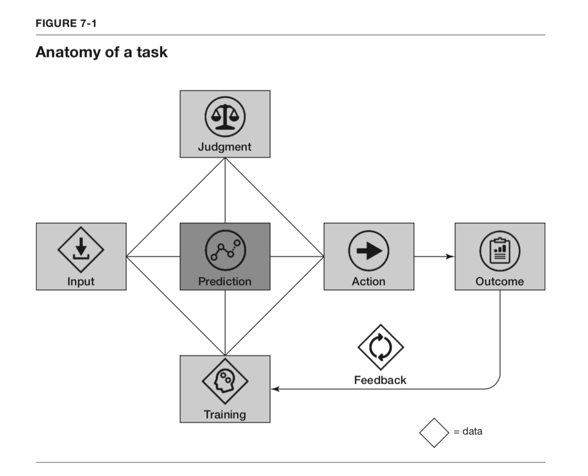
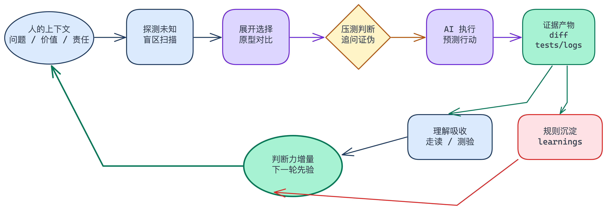
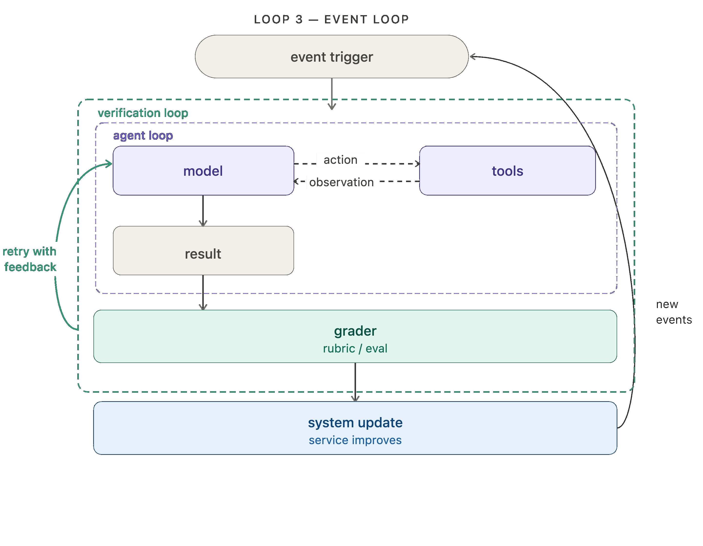
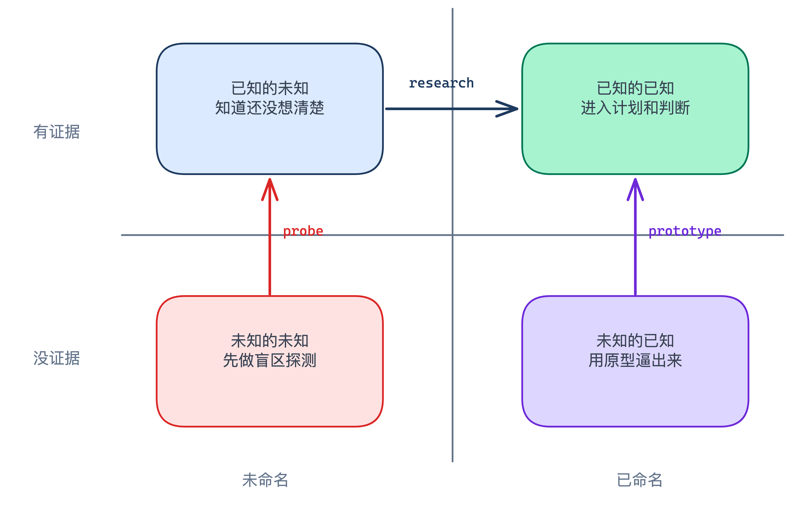

你有没有过这种感觉：脑子里刚闪过一个念头，手已经把它发给了 AI。模型要么直接给你结论，要么一步一步带你把推理走完。过程很顺，产出也体面，可事后回想，脑子里留下的不是一条连贯的思路，而是一堆连不起来的碎片。结论我记得，怎么推出来的，我说不上来。

心理学管这个叫认知卸载：人只要相信一件事以后查得到，就不会去记它。我们早就把记忆交给了搜索引擎，如今连“把碎片连起来”这项认知劳动也一并交了出去。

认知卸载不是新鲜事，但它影响的范围在扩大。过去交出去的是记忆，现在交出去的是推理过程本身。而推理正是判断力赖以维持的肌肉。

1983 年，认知心理学家 Lisanne Bainbridge 在《自动化的反讽》中揭示过一个悖论：自动化水平越高，需要人工处理的突发状况就越少见、越复杂，对操作员的要求反而越高。但高水平技能靠的是频繁练习，当自动化接管了日常，操作员退化成监控者，真到紧急时刻反而接不住。这不仅适用于动手能力，也适用于认知能力。人的判断力需要快速、频繁、有后果的反馈来保持敏锐。

Bainbridge 担心的是“人不会操作了”。AI 时代的问题更深一层：不是“不会做”，而是“不会判断”和“失去掌控”。

传统自动化在异常时崩溃，把控制权交还给你。你至少知道何时该接手。AI 不会这样。它只会持续输出，可能是错的，但格式漂亮、语气稳定、论证完整。你必须持续判断“这个对不对、该不该信、要不要改”。判断成了日常操作，而不是紧急任务。也正因为它每天都在发生，你反而最容易对它麻木。

那么，“判断”和“掌控”在整个决策链条里到底处于什么位置？

Agrawal、Gans 和 Goldfarb 在 [《Prediction Machines》](https://www-2.rotman.utoronto.ca/insightshub/ai-analytics-big-data/prediction-machines-simple-eco) 中给出了一个清晰框架：任何决策都包含五个要素：数据、预测、判断、行动和结果。随着 AI 让“预测”和“行动”变得极其便宜，人类的核心竞争力自然转移到另外三个环节：提供上下文、行使判断、承担结果。

_图源：《Prediction Machines》，Figure 7-1，Anatomy of a task。_

这里我更愿意把原书里的“数据”展开成“上下文”。在 AI 时代，数据本身不稀缺，稀缺的是数据背后的业务语境：用户画像、场景约束、资源边界、竞品动态、组织内隐性知识、某个项目过去踩过的坑。模型的上下文窗口终究有限且易逝，而人的上下文可以跨越时间积累。上下文让判断有了锚点，让价值权衡不再是空中楼阁。

在这个框架里，判断是核心。我理解的判断至少包含这些东西：如何从意图定义问题，如何排序冲突，如何控制复杂度，如何决定边界，如何选择交付形态，如何评估证据，如何判断一个任务是否真的完成。很多时候，事情没交给 AI，并不是模型能力不够，而是人没有给出足够的上下文，或者压根没意识到这个问题可以被拆成适合 AI 协作的形态。判断缺位，比能力缺位更常见。

掌控建立在判断之上。我把它拆成两层：理解和控制。理解，是你能独立讲清楚这份产出的全貌，知道它做了什么关键决策，每个决策的依据是否能验证并认可。控制，是你能让模型的产出符合你的预期，是可验证、可干预的，而不是放出一匹脱缰的马。掌控感不是“我点了接受”，而是你清楚自己输入了什么上下文、为什么做出这个判断，并愿意承担由此产生的结果。

上下文、判断、结果，说起来像三条护城河。但它们并不好守。预测和行动被外包之后，判断和掌控会发生退化，原因有四个。

第一，角色变化。AI 接管生产之后，人不再是做的那个，而是看做完的那个。评估比执行更吃经验，也更容易敷衍。你不再经历中间的摩擦，只看到最后的答案。中间过程被抹平，判断力的训练样本也被抹平了。

第二，后果稀释。判断是靠后果喂出来的。选错，疼一下，记住，下次改。但执行被接管之后，你亲手踩坑的机会骤减。代码不是你写的，坑不是你摔的，修也未必经你的手。模型那边也存不住教训。两头都不沉淀，教训就真丢了。

第三，回路黑箱化。vibe coding 最危险的地方不是“快”，而是它让掌控感变成幻觉。你觉得自己在开车，其实只是坐在副驾上说“继续”。当你不读 diff、不追踪假设、不要求证据，AI 的输出会越来越像一条黑箱流水线。它可能有用，但它不再训练你。

第四，培养判断力的土壤在流失。以前练判断要经过学习、实践、试错。如今这条路正在变窄。老手用 AI 加速自己本来就会的事，新手用 AI 学自己还不会的事，两者天差地别。老手能判断什么该信，什么该改；新手更容易全盘接受，堆出看起来像那么回事、一碰就塌的“纸牌屋代码”。

所以问题不在于 AI 本身有多强，而在于人与 AI 之间的回路出了问题。

2005 年首届自由式国际象棋世锦赛，最终夺冠的不是携顶级 AI 的特级大师，而是两个美国业余棋手。Kasparov 的复盘是：弱人 + 机器 + 更好的流程，胜过强人 + 机器 + 糟糕的流程。拉开差距的不是 AI 的强弱，而是回路的构造。

但这个故事自身也在被时间侵蚀。后来纯 AI 超过了人机组合，[loop engineering](https://addyosmani.com/blog/loop-engineering/) 又开始把越来越多“判断”也交给 AI。趋势很清晰：人的角色正在从裁决者向启动键和保险丝滑移。

但在那天到来之前，人还在环里。问题变成了：应该构造什么样的回路，才能在 AI 加速的同时，训练而不是消磨我们的判断力和掌控力？

这让我想到模型训练本身。模型怎么变强的？预训练在海量语料里学分布，把知识压进权重；后训练里，RLHF 也好，RLVR 也好，模型在反馈信号里试错，策略被奖励一点点塑形。人的学习结构上是同一回事：能力等于先验加反馈。读书、看案例、让人带着，是在建先验；亲自做、承担后果，是在拿真实世界的反馈更新策略。

人比模型占便宜的地方是样本效率。模型更新偏好要成千上万条标注，人只要看少量摊开的决策过程，就能刷新自己对“好判断”的直觉。这意味着，如果回路是透明的，人的判断力可以形成一个自我加速的飞轮。

这张图里最重要的不是 AI 执行，而是执行前后的那几段：发现未知、展开选择、压测判断、证据裁决、理解吸收、规则沉淀。它们看起来像流程，其实是在制造反馈密度。判断力更强，你就能识别更好的产出；给模型更精确的约束，模型表现更好；模型给出更微妙的方案，你又能审问得更深。判断力由此继续增长。

我后来发现，这套回路要想长期有效，不能只停留在“下次我注意一点”的层面，而要拆成几个稳定动作：动手前先探测盲区，发散出足够不同的方案，用反向追问压测判断，把已知证据讲清楚，交付后再做结构化走读。它们不是为了给工作流增加仪式感，而是为了保护图里那条水流：让每一次 AI 协作，都能留下一点判断力的增量。

飞轮听起来美好，但它有两个前提。

第一，人必须真的在审问，而不是被模型的解释驯化。模型很擅长把一个答案讲得像答案。它越会解释，人越容易把“听起来通顺”误认为“我已经理解”。所以回路里必须有对抗和证伪，必须有人专门打断顺滑叙事，问它证据在哪里、边界在哪里、替代解释在哪里。

第二，飞轮必须不是黑箱。Loop Engineering 解决的是“如何让回路跑起来”，把人从逐轮提示的人，变成设计循环的人。它的价值很清楚：系统可以自己发现任务、分发任务、调用 agent、检查结果、记录状态，再决定下一步。

_图源：LangChain, [The Art of Loop Engineering](https://www.langchain.com/blog/the-art-of-loop-engineering)。_

但跑起来不等于健康。工程对象可以不再是代码，甚至不再是提示词，但回路内部必须是可理解、可干预、可验证的。我把这三个要求缩写成 CCV：Comprehensible, Controllable, Verifiable。

可理解，意味着产出不仅要对，还要能被人消化。你要能讲清楚它为什么这么做，改了哪些关键路径，哪些假设支撑了这个方案。可干预，意味着你能把偏好和边界写成规则，而不是每次靠临场感觉。可验证，意味着你不用相信模型的语气，只看证据是否足够。

这三个原则落到实践里，就是五件事。

第一，给判断力写测试。

写规则的本质，是把模糊的直觉转化为可执行的断言。每次你对 agent 产出产生不适感，不要跳过。强制自己追问：哪里不对劲？能不能拦截？怎么拦截？答案写成规则，规则就是判断力的单元测试。

规则能拦住同类问题，说明你的判断被编码成功；规则放过了不该放的问题，说明判断有 bug，需要改规则。最忌讳的是只写不做。规则进了代码库，品味才有版本历史。系统可以捕获改进信号，但修宪权必须在人。

第二，用裁决练判断力。

判断力退化的根源之一不是不想练，而是没东西可练。在组织里，只有升到一定位置才有足够多的决策权，才有判断场景。AI 接管执行后，这个瓶颈反而被打开了。一个 agent 可以不断地产生方案、diff、测试、日志和失败。你面对的判断密度变高了：架构过不过？评审发现是真问题还是误报？证据够不够放行？这个 tradeoff 是局部最优还是长期债务？

裁决的价值在反馈闭环。判断错了，事后翻台账能定位是哪一次判断失误，从而校准自己的标准。在单人团队里，agent 是不知疲倦的产线，你是唯一的质检员。只要裁决有记录、有后果、有复盘，判断力就会在密集反馈中被训练。

第三，主动发现自己的未知。

判断力退化的一个隐蔽原因是：你不知道自己不知道什么。问题空间可以粗略分成四块：已知的已知、已知的未知、未知的已知、未知的未知。

顶尖的 agent 操控者，往往不是 prompt 写得更花，而是未知更少。他们对代码库、问题域和模型行为都有深度同步。但他们也不假设自己没有盲区。减少未知，为未知做预案，本身就是在练判断力。

具体做法很朴素：动手之前，先让模型做一次盲区扫描，把你的经验水平、对问题域的熟悉度、已知约束说清楚，让它找出你可能遗漏的维度。然后用原型和头脑风暴暴露“未知的已知”：很多偏好你说不出口，但看到错的版本能立刻反应。最后让模型反过来采访你，聚焦那些“你的回答会改变架构”的问题。每一次约束被显性化，都是判断力的一次增量提交。

第四，理解是参与的前提，而不只是验证的手段。

很多人把“理解 agent 的产出”等同于“检查对不对”，像一个 thumbs-up/thumbs-down 的动作。但理解的真正价值不在验证，在参与。一个项目不是一次循环，而是和模型的无数次循环。你对系统的理解深度，直接决定了你能提出什么样的下一步。脑子里缺少足够丰富的概念模型，你就无法流畅地思考系统该如何演进。

这也是为什么逐行读 diff 不是唯一的路径，甚至不是最好的。我开始让 agent 在每次交付后生成结构化走读：先讲背景知识，再讲变更直觉，然后按逻辑顺序编排代码，而不是按文件名顺序罗列。更进一步，我会让它在解释末尾附上测验题。规则很简单：过不了测验，不合代码。

测验是回路的调速器。当 AI 的执行速度远超人的理解速度时，你需要一个机械化检查点来问自己：我真的懂了吗？这不是形式主义，而是防止自己从创造性参与者滑成盖章机器。

第五，裁决要留痕，教训要显式沉淀。

后果稀释是判断力退化的核心原因之一。对策是让回路显式记录偏差：执行过程中遇到了什么边界情况，哪些假设错了，哪里偏离了原计划，评审为什么放行或驳回。这样，那些本该由你亲手踩到的坑，就转化成了可读的决策样本。

会话结束后，回顾这些偏差点，判断哪些是你的盲区，哪些是计划漏洞，哪些需要新规则来拦截。这就是在用廉价样本做昂贵学习。模型可以替你多走几条路，但你必须把路上的分岔和摔跤记下来，否则它们不会变成你的经验。

把品味和判断力说成 AI 时代的护城河，是现在很流行的讲法。但我越来越觉得这个意象选错了。

护城河是存量：挖好，蓄满，守住。判断力不是这样的。判断力不练就退化。上下文不更新就过期。规则不校准就僵化。经验不复盘就只剩感觉。

真正能经营的不是某个静态能力，而是生成能力的速度。这才是水源。水源不在某个人脑子里，也不在某条 prompt 里，而在一个不断把上下文、行动、证据、裁决和复盘接起来的回路里。

所以这套回路对我来说，不是一组“让 AI 干更多活”的技巧，而是一个把人重新放回协作中心的方法。探测不是为了让 AI 替我想，而是防止我带着盲区开始；发散不是为了多几个选项，而是逼出我的隐性偏好；拷问不是为了显得严谨，而是防止我被顺滑叙事带走；解释和走读不是交付后的包装，而是让我重新获得参与下一轮决策的能力。

回路自己也有保质期。回路是文本，写得出来就抄得走。模型越强，回路要补的越少，越容易人手一条。等大家的回路都差不多，拉开差距的就只剩回路的产物：被回路练了几年的人复制不了。环越练越好抄，人越练越难追。

所以有竞争力的从来不是 human in the loop，而是 expert in the loop。

再往远处想一层。如果有一天，模型强到把专家判断也一层层吃掉呢？我没有答案，只有一个方向：判断的经济学定义是为结果赋值，而你要什么，只有你说了算。这一层没法外包，因为它不是能力，是立场。

“谁拥有问题、谁对结果负责”，也许比“谁会解”更持久。解法会贬值，问题不会。真到了那一天，护城河大概不在任何一层能力上，而在你和问题的关系上。在那之前，先把环造好，把自己练成环里的 expert。
